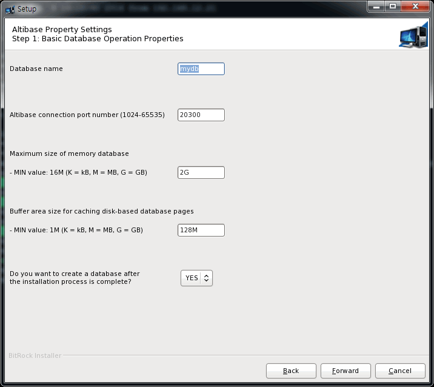
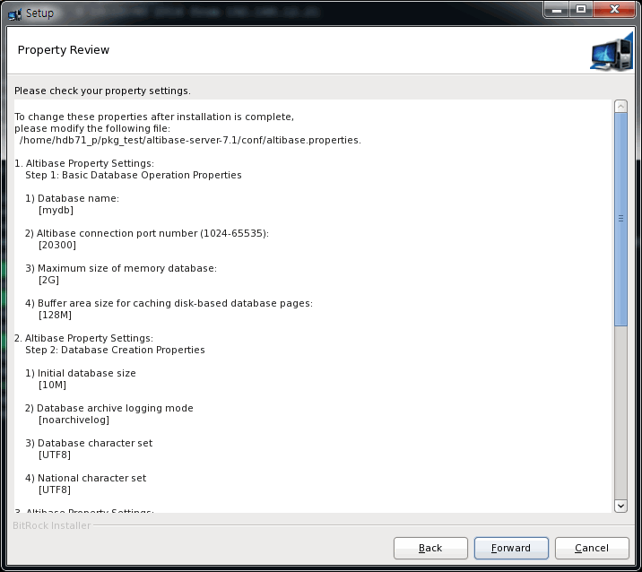
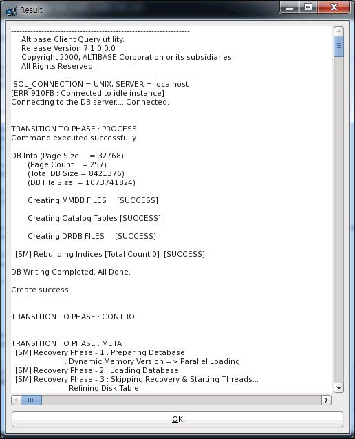
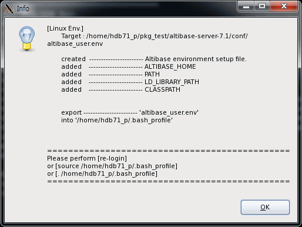
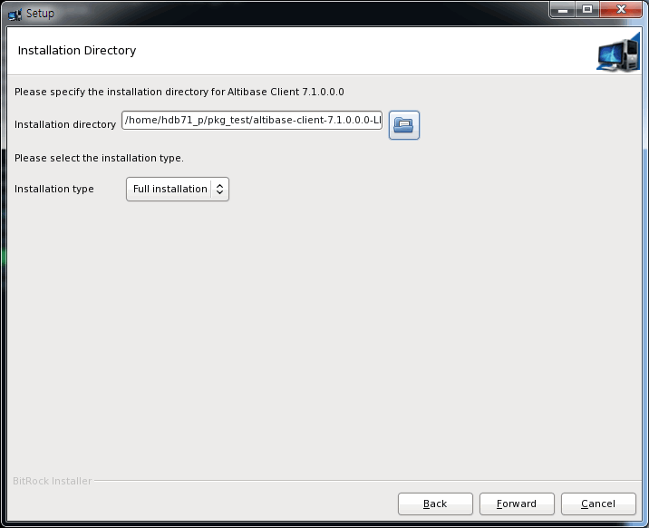
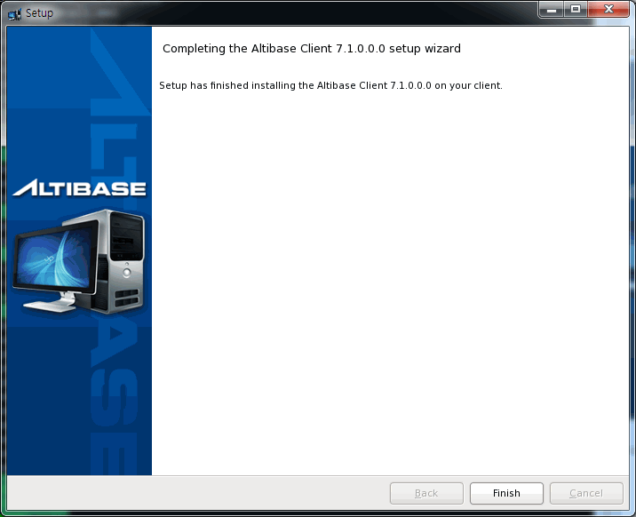

# 2. Installing Products with the Altibase Package Installer

This chapter consists of the following sections:

-   [System Requirements](#system-requirements)

-   [Altibase Package Installer](#altibase-package-installer)

-   [Installing Altibase Products](#installing-altibase-products)

-   [Installing Altibase Client Products](#installing-altibase-client-products)

### System Requirements

The following system requirements must be met to install and operate ALtibase.

The requirements and recommendations listed in this chapter assume that your database will be used for general purposes. If you plan to use your database for a special purpose, contact [Altibase's Customer Support site](http://support.altibase.com/en/) for more detailed information about system requirements.

#### Memory

64-bit OS: Minimum 1GB (2GB recommended, unlimited)

#### CPU

1 CPU or more (2 or more CPUs are recommended)

#### Hard Disk

Altibase requires a disk with sufficient storage space to hold tablespaces (to store data), transaction logs, and Altibase software. Altibase software and transaction logs require at least 1GB of space, respectively.

You should have at least 12GB of free disk space to smoothly run the database.

#### Network

It is recommended to use a dedicated line when using the replication feature.

### Altibase Package Installer

#### Basic Steps for Installing Altibase

To install Altibase products, follow the steps below. More detailed description of each process is provided in detail in the product installation according to the operation system.

1.  Check the Environment Before Installation

2.  Download the Altibase Package Installer

3.  Start the Altibase Package Installer

4.  Enter the Installation Directory and Select the Installation Type

5.  Set Altibase Properties

6.  Confirm Altibase Properties

7.  Install the Altibase Product

8.  Register the Altibase License Key

9.  Preview the Altibase Quick Setting Guide

10. Finish Installation

11. Post-installation Tasks

#### Download the Altibase Package Installer

You can download the appropriate Package Installer for your operating system from [Altibase's Customer Support site](http://support.altibase.com/en/)

Altibase Package Installer names follow the rule below:


- Altibase Server Package Installer
:    altibase-server-7.3.0.0.0-LINUX-X86-64bit-release.run
- Altibase Client Package Installer
:    altibase-client-7.3.0.0.0-LINUX-X86-64bit-release.run


The Altibase Server Package and Client Package are distributed in separate packages. However, the Altibase Server Package includes the Client Package.

The Altibase Package Installer is provided for the following operating systems. Before installing, check the OS related information with the following command and select the appropriate package installer.

```bash
$ uname -a
Linux rhel6-x64 2.6.32-71.el6.x86_64 #1 SMP Wed Sep 1 01:33:01 EDT 2010 x86_64 x86_64 x86_64 GNU/Linux
```

| OS    | CPU                           | Version         | Bit (Server) | Bit (Client) |
| ----- | ----------------------------- | --------------- | ------------ | ------------ |
| AIX   | PowerPC                       | 6.1 tl03 or higher   | 64-bit       | 64-bit      |
| HP-UX | IA64                          | 11.31 or higher      | 64-bit       | 64-bit      |
| LINUX | x86-64 (GNU glibc 2.12 ~2.33) | redhat 6.0 or higher | 64-bit       | 64-bit      |

Altibase 7.1 is compatible with JDK 1.5 or higher.

#### Installation Mode

The Altibase Package Installer runs in one of the following modes:

-   Interactive Command-line Mode: If the DISPLAY environment variable has not been set.
    
-   GUI (Graphical User Interface): If the DISPLAY environment variable has been set.

### Installing Altibase Products

This section explains how to install an Altibase Product.

-   [Check the Environment Before Installation](#check-the-environment-before-installation)

-   [Download the Package Installer](#download-the-package-installer1)

-   [Set the Installation Mode](#set-the-installation-mode)

-   [Start the Altibase Package Installer](#start-the-altibase-package-installer)

-   [Enter the Installation Directory and Select the Installation Type](#enter-the-installation-directory-and-select-the-installation-type)
    
-   [Check System Parameters](#check-system-parameters)

-   [Set Altibase Properties](#set-altibase-properties)

-   [Confirm Altibase Properties](#confirm-altibase-properties)

-   [Install the Altibase Product](#install-the-altibase-product)

-   [Register or Update the Altibase License Key](#register-or-update-the-altibase-license-key)

-   [Preview the Altibase Quick Settings Guide](#preview-the-altibase-quick-settings-guide)

-   [Finish Installation](#finish-installation)

-   [Post-Installation Tasks](#post-installation-tasks)

#### Check the Environment Before Installation

The Altibase Package Installer checks the environment before installing the product to see if the environment of the installed equipment meets the requirements for a successful installation. This process is performed without a graphical user interface (GUI).

During this operation, the Altibase Package Installer checks the following information about the server: 

-   The operating system name and version

-   The operating system mode (64-bit)

If you have downloaded an Altibase Package Installer that does not match your operating system, an error message is returned and the installation will be aborted. Finding problems with the system configuration in the previous step reduces the likelihood of encountering problems during installation.

#### Download the Package Installer

You can download the appropriate Package Installer for your operating system from [Altibase's Customer Support site](http://support.altibase.com/en/).

For more detailed information about supported operating system, please refer to  "[Download the Altibase Package Installer](#download-the-altibase-package-installer).

#### Set the Installation Mode

The Altibase Package Installer runs in one of the following modes:

-   Interactive Command-line Mode: if the DISPLAY environment variable has not been set.
-   Graphic User Interface (GUI) : If the DISPLAY environment variable has been set.

This manual assumes that the Altbiase Package Installer's installation mode is set to GUI.

##### Set GUI Mode

Users can run the Altibase Package Installer in GUI mode by setting the DISPLAY environment variable on the host computer as follows: 

```bash
$ setenv DISPLAY <machine name>:0.0
```

<machine_name> is the IP address or host name of the computer that is to display the Altibase Package Installer process. Use the `setenv` command for Shell or set `export DISPLAY=<machine name>:0.0` for Korn Shell.

In order to allow the Altibase Package Installer to run in GUI mode at a remote location other than the host computer, run the following command on the remote computer: 

```bash
$ xhost +
```

#### Start the Altibase Package Installer

To run the Altibase Package Installer, a user needs to download the Package Installer and then change file permissions, using chmod.

```bash
$ chmod +x altibase-server-7.3.0.0.0-LINUX-X86-64bit-release.run
```

Run the Altibase Package Installer.

```bash
$./altibase-server-7.3.0.0.0-LINUX-X86-64bit-release.run
```

<div class="image_description" markdown>
{ width=720 align=left } 
If the Package Installer is set to GUI mode, the Setup wizard on the left appears:
</div>

#### Enter the Installation Directory and Select the Installation Type

<div class="image_description" markdown>
  { width=720 align=left }
  In the installlation directory panel, select the Altibase home directory, the directory where Altibase will be installed, and the package installation type.<br>
  To install an Altibase product, click "Full Installation" in the Installation Type list: to install a patch for a previously installed version, click "Patch Installtion" in the Installation Type list.
</div>

<div class="image_description" markdown>
  { width=720 align=left } 
  If Altibase product has already been installed to the specified directory, a warning message appears. In this case, enter another directory or uninstall the product installed in the specified directory first.
</div>

#### Check System Parameters

<div class="image_description" markdown>

{ width=720 align=left } 

The following dialog box displays the necessary system kernel parameters and how to set them.<br>System kernel parameters must be set using the root account. Some systems need to be rebooted after kernel parameters have been set.
!!! tip
    Kernel parameters should be manually set before proceeding to the next step. To set them after installation is complete, please refer to the $ALTIBASE_HOME/install/pre_install.sh file.
</div>

To ensure that Altibase runs properly, you should configure your system environment first. To do so, you must modify kernel parameter values using root privileges before installing Altibase. Kernel parameter values may be modified after installation; however, they must be set before running Altibase. The following is an example of showing the recommended values of system kernel parameters for each OS. For more detailed information on OS-specific kernel parameters, please refer to [*Installation Prerequisites*](#appendix-a-installation-prerequisites).

!!! example
    === "HPUX"
        ```bash
        [ Recommended Kernel Parameter Values ]

        shmmax = 2147483648
        shmmni = 500 
        shmseg = 200 
        semmap = 1001
        semmni = 1000
        semmns = 4096
        semmnu = 1000
        semume = 1000
        max_thread_proc = 600
        maxusers = 64
        dbc_min_pct = 5
        dbc_max_pct = 5
        maxdsiz = 1073741824
        maxdsiz_64bit = 4294967296 
    
        # maxdsiz_64bit
        The Altibase server needs sufficient memory space to function properly.
        Please set the value to 70% of system memory or greater.
    
        # dbc_min_pct and dbc_max_pct 
        dbc_min_pct and dbc_max_pct were renamed filecache_min and filecache_max, respectively, in HP version 11.31 and subsequent releases.
    
        [ How to modify kernel parameter values ] 
    
        /usr/sbin/kmtune -s shmmax=2147483648
        /usr/sbin/kmtune -s shmmni=500 
        /usr/sbin/kmtune -s shmseg=200
        /usr/sbin/kmtune -s semmap=1001 
        /usr/sbin/kmtune -s semmni=1000
        /usr/sbin/kmtune -s semmns=4096 
        /usr/sbin/kmtune -s semmnu=1000
        /usr/sbin/kmtune -s semume=1000
        /usr/sbin/kmtune -s max_thread_proc=600
        /usr/sbin/kmtune -s maxusers=64
        /usr/sbin/kmtune -s dbc_min_pct=5
        /usr/sbin/kmtune -s dbc_max_pct=5
        /usr/sbin/kmtune -s maxdsiz=1073741824 
        /usr/sbin/kmtune -s maxdsiz_64bit=4294967296
    
        # maxdsiz_64bit
        The Altibase server needs sufficient memory space in order to function properly.
        Please set the value to 70% of system memory or greater.
    
        # dbc_min_pct and dbc_max_pct 
        dbc_min_pct and dbc_max_pct were renamed filecache_min and filecache_max, respectively, in HP version 11.31 and subsequent releases.
        ```
    === "LINUX"
        ```bash
        [ How to modify kernel parameter values ]
    
        echo 512 32000 512 512 > /proc/sys/kernel/sem
        ```
    === "AIX"
        ```bash
        [ Recommended Kernel Parameter Values ]
    
        fsize = -1
        data = -1
        rss = -1
    
        Maximum number of PROCESSES allowed per user
            = greater than the value set using the Altibase property MAX_CLIENT
    
        Size of the File System BufferCache
            = less than 20% of total memory.
    
        AIO = Available
    
        AMO = AIX version 5.2 ML04 and above
                    lru_file_repage=0
                    strict_maxclient%=0
                    = Versions prior to AIX version 5.2 ML04
                    lru_file_repage=0
    
        [ How to modify kernel parameter values ]
    
        Edit /etc/security/limits file
        Set fsize, data and rss variables.
    
        Run 'smit'
            1) System Environments
            System Environments -> Change / Show Characteristics Of Operating System
            Change : 
                Maximum number of PROCESSES allowed per user
                    = bigger than the value set using the Altibase property MAX_CLIENT
                Size of the File System BufferCache
                    = less than 20% of total memory.
            2) AIO 
                Device -> Asynchronous I/O -> Posix Asynchronous I/O -> Configure Defined Asynchronous I/O
                Change : posix_aio0=Available
    
            3) AMO 
                Performance & Resource Scheduling -> Tuning Kernel & Network Parameters -> Tuning Virtual Memory Manager, File System and Logical Volume 
                    Manager Params ->
                    + List All Characteristics of Current Parameters --- Check
                    + Change / Show Current Parameters --- Current Change
                    + Change / Show Parameters for Next Boot --- Change upon Reboot
    
                The case of AIX version 5.2 ML04 and above :
                    Change : lru_file_repage=0
                        strict_maxclient%=0
                The case of Versions prior to AIX version 5.2 ML04 :
                    Change : lru_file_repage=0
        ```

#### Set Altibase Properties

[Step 1: Basic Database Operation Properties](#step-1-basic-database-operation-properties)

[Step 2: Database Creation Properties](#step-2-database-creation-properties)

[Step 3: Set Database Directories](#step-3-set-database-directories)

##### Step 1: Basic Database Operation Properties

<div class="image_description" markdown>
{width=720 align=left}

-   Database name
-   Connection Port Number
-   Maximum size of Memory Database
-   Buffer Area Size
-   Choose whether or not to create a SQL script to create a new database (whether or not to perform step 2).<br>

    !!! tip
        If you click YES, step 2 is performed; otherwise, step 2 is skipped. Regardless of whether or not a SQL script is created in this step, a new database can be created with the following command.<br>
        ```bash
        server create [DB Character-set] [National Character-set]
        ```
</div>

##### Step 2: Database Creation Properties

<div class="image_description" markdown>
{width=720 align=left}

-   Initial Database Size
-   Database Archive Logging Mode
    - Noarchivelog
    - Archivelog
-   Database Character Set
    - MS949
    - US7ASCII
    - KO16KSC5601
    - BIG5
    - GB231280
    - MS936
    - UTF-8
    - SHIFT-JIS
    - MS932
    - EUC-JP
-   National Character Set
    - UTF-16
    - UTF-8
    </div> 
    
!!! tip
     The SQL script created in step 2 is stored in the $ALTIBASE_HOME/install/post_install.sh file.

##### Step 3: Set Database Directories

<div class="image_description" markdown>
{width=720 align=left}

-   Default Disk Database Directory

-   Memory Database Directory

-   Archive Log Directory

-   Transaction Log Directory

-   Log Anchor Files Directory

To set the values of properties excluded in this step, or to later change the value of properties that have been set in step 1 or are to be set in step 3, edit the $ALTIBASE_HOME/conf/altibase.propertites file manually.
</div>

#### Confirm Altibase Properties

<div class="image_description" markdown>
{width=720 align=left}

The panel box on the left displays property values taht have been set in the previous step.
</div>

??? example
    
    ```
    To change these properties after installation is complete, 
    please modify the following file:
    /home/hdb71_p/pkg_test/altibase-server-7.3/conf/altibase.properties.
    
    1. Altibase Property Settings:  
        Step 1: Basic Database Operation Properties
    
    1) Database name: 
         [mydb]
    2) Altibase connection port number (1024-65535): 
         [20300]
    3) Maximum size of memory database:
         [2G]
    
    4) Buffer area size for caching disk-based database pages:
         [128M]
    
    2. Altibase Property Settings:
        Step 2: Database Creation Properties
    
    1) Initial database size
         [10M]
    
    2) Database archive logging mode
         [noarchivelog]
    
    3) Database character set
         [UTF8]
    
    4) National character set
         [UTF8]
    
    3. Altibase Property Settings:
        Step 3: Set Database Directories
    
    The database will not operate properly if any of these directories are removed.
    
    1) Disk database directory: 
         [/home/hdb71_p/pkg_test/altibase-server-7.3/dbs] 
    
    2) Memory database directory:
         [/home/hdb71_p/pkg_test/altibase-server-7.3/dbs] 
    
    3) Archive log directory: 
         [/home/hdb71_p/pkg_test/altibase-server-7.3/arch_logs] 
    
    4) Transaction log directory: 
         [/home/hdb71_p/pkg_test/altibase-server-7.3/logs] 
    
    5) Log Anchor file directories:
         Directory 1: 
         [/home/hdb71_p/pkg_test/altibase-server-7.3/logs] 
    
         Directory 2: 
         [/home/hdb71_p/pkg_test/altibase-server-7.3/logs] 
    
         Directory 3: 
         [/home/hdb71_p/pkg_test/altibase-server-7.3/logs] 
    ```

<div class="image_description" markdown>
{width=720 align=left}
After confirming these values, click "Forward". Then, "Read to Install" panel will be shown as left: <br>
Click "Forward" continue with the Installation.
</div>

#### Install the Altibase Product

<div class="image_description" markdown>
{width=720 align=left}

When the installation is completed, the Package Installer performs the following operations without GUI:

-   The properties set are updated in the altibase.properties files.

-   The altibase_user.env.file containing the basic environment for running the Altibase server is created in the $ALTIBASE_HOME/conf directory. The command to run this file is then added to the user account's configuration file (such as .bashrc or .bash_profile or .profile).
</div>

The following are examples of the altibase_user.env file and the .bash_profile file. 

=== "altibase_user.env"
    ```bash
    ALTIBASE_HOME=/home/hdb71_p/pkg_test/altibase-server-7.3;export ALTIBASE_HOME 
    PATH=${ALTIBASE_HOME}/bin:${PATH};export PATH 
    LD_LIBRARY_PATH=${ALTIBASE_HOME}/lib:${LD_LIBRARY_PATH};export LD_LIBRARY_PATH 
    CLASSPATH=${ALTIBASE_HOME}/lib/Altibase.jar:${CLASSPATH};export CLASSPATH 
    ```
=== ".bash_profile"
    ```bash
    . /home/hdb71_p/pkg_test/altibase-server-7.3/conf/altibase_user.env
    ```

#### Register or Update the Altibase License Key

<div class="image_description" markdown>
{width=720 align=left}

The dialog box on the left is where you register your Altibase license key. You can register the license key with the Altibase Package Installer by either: 

-   Entering the license key directly

-   Selecting a file containing license key information

-   Postponing license registration: If you have no obtained the license key yet, then you can copy a new license file to the $ALTIBASE_HOME/conf directory after you have obtained one.
    ```bash
    $ cp license $ALTIBASE_HOME/conf/
    ```
    
    !!! note
          if you do not enter the license key at this step, the Package Installer does not ask whether or not to create a database at the next step.
    </div>

#### Preview the Altibase Quick Settings Guide

The "Altibase Quick Setting Guide" dialog box shows you how to start Altibase after it has been installed successfully. 

The Altibase Package Installer provides the following two shell scripts to help users configure system kernel parameters and environment variables easier.

-   $ALTIBASE_HOME/install/pre_install.sh  
    This script contains the minimum set of essential system kernel parameters, their recommended values, and explain how to set them
    
-   $ALTIBASE_HOME/install/post_install.sh  
    This script contains a SQL script for creating a new database (if step 2 was performed for Set Altibase Properties).
    
-   $ALTIBASE_HOME/packages/catproc.sql  
    This script contains a SQL script for using PSM.

If you select the checkbox in the next panel, the Altibase Package Installer will create a new database and run a script to use PSM, which will take a bit longer to install. If you do not select the checkbox, you must manually create the new database and run the PSM script after installation.

<div class="image_description" markdown>
{width=720 align=left}
</div>

??? example
    ```bash
    [  Installation complete  ]
    Please refer to the file listed below to verify the Altibase version.
     /home/hdb71_p/pkg_test/altibase-server-7.3/APatch/patchinfo 

    [ Quick Guide to Making Settings in Altibase ] 
    
    1. Set kernel variables using the root user account.
        run the '/home/hdb71_p/pkg_test/altibase-server-7.3/install/pre_install.sh' file 
        - This script helps you make kernel parameter settings.
    
    ================ LINUX ================
    [ How to modify kernel parameter values ]
    
    echo 512 32000 512 512 > /proc/sys/kernel/sem
    
    These values must be set in order for Altibase to operate properly.
    They must be set such that they are suitable for the system configuration.
    
    =====================================


    2. Provide a license.
        Please rename and locate the license file as shown below.
        /home/hdb71_p/pkg_test/altibase-server-7.3/conf/license 
    
        If no license file has been issued, or if the license file has expired,
        Altibase services will not start.
        In this case, please visit http://support.altibase.com.


    3. Configure user environment variables (using the user account with 
        which Altibase was installed).
        Run the '/home/hdb71_p/pkg_test/altibase-server-7.3/install/post_install.sh' file 
        under the account with which Altibase was installed.
    
        This script performs necessary post-installation configuration. 
    
        1) Create the Altibase user environment file and apply it to the user profile.
             (/home/hdb71_p/pkg_test/altibase-server-7.3/conf/altibase_user.env)
        2) Create a database.
    
             If you selected 'YES' in response to the question about whether to create 
             a database after installation, at "Altibase Property setting step 1", 
             a database will be automatically created.
    
             If you selected 'NO' in response to this question,
             you need to create a database manually.
    
             shell> server create [DB Character Set] [National Character Set]
    
    4. Start up and shut down the server
        shell> server start
        shell> server stop
    
    5. Runs all scripts required for or used with PSM
    Run the '/home/hdb71_p/pkg_test/altibase-server-7.3/packages/catproc.sql' file.
    
    6. Connect to the database using iSQL
        shell> isql -s 127.0.0.1 -u SYS -p MANAGER
    ```

The following message appears while a database is being created.




#### Finish Installation

<div class="image_description" markdown>
{width=720 align=left}
After successful installation, the panel box on the left appears.
</div>

<div class="image_description" markdown>
{width=720 align=left}
Click "Finish", and the "Environment Setting Guide" message box appears:
</div>

#### Post-Installation Tasks

After successful installation, a user needs to:

1.  Set the parameters manually if system kernel parameters have not been set during installation. Please refer to the $ALTIBASE_HOME/install/pre_install.sh file. 
    
2.  Perform either of the following to invoke a login shell: 

     -   Log out and then login again

     -   Execute . ~/.bash_profile

     -   Execute source ~/.bash_profile

3. Create a database as below, if a database was not created during the installation:

     - If properties for database creation were set during the installation, execute the $ALTIBASE_HOME/install/post_install.sh script.

     ```bash
     $ sh post_install.sh dbcreate
     ```

     - If properties for database creation were not set during the installation, execute the server script.

     ```bash
     $ server create utf8 utf8
     ```

     - If properties for using PSM were not set during the installation, execute the catproc.sql script.
  
     ```sql
     $ isql -s 127.0.0.1 -u sys -p manager -silent -f
     ${ALTIBASE_HOME}/packages/catproc.sql
     ```

### Installing Altibase Client Products

The following sections describe how to install an Altibase Client Product: 

-   [Checking the Environment Before Installation](#checking-the-environment-before-installation-1)

-   [Downloading the Package Installer](#downloading-the-package-installer)

-   [Setting the Installation Mode](#setting-the-installation-mode-1)

-   [Starting the Altibase Package Installer](#starting-the-altibase-package-installer-1)

-   [Entering the Installation Directory and Selecting the Installation Type](#entering-the-installation-directory-and-selecting-the-installation-type1)
    
-   [Setting Altibase Client Properties](#setting-altibase-client-properties)

-   [Installing the Altibase Client Product](#installing-the-altibase-client-product-1)

-   [Finishing Installation](#finish-installation-1)

-   [Post-Intallation Tasks](#post-installation-tasks-1)

#### Checking the Environment Before Installation

Please refer to [Check the Environment Before Installation](#check-the-environment-before-installation) in the "Installation Altibase Product" section

#### Downloading the Package Installer

You can download the appropriate Package Installer for your operating system from [Altibase's Customer Support site](http://support.altibase.com/en/).

Please refer to [Download the Altibase Package Installer](#downloading-the-altibase-package-installer) for more detailed information on the supported operating system.

#### Setting the Installation Mode

To start the Altibase Package Installer in GUI mode, please refer to [Set the Installation Mode](#set-the-installation-mode).

#### Starting the Altibase Package Installation

To run the ALtibase Package Installer, the user must download the Package Installer and then change the permissions of the file by using chmod. 

```bash
$ chmod +x altibase-client-7.3.0.0.0-LINUX-X86-64bit-release.run
```

Run the Altibase Package Installer

```bash
$./altibase-client-7.3.0.0.0-LINUX-X86-64bit-release.run
```

<div class="image_description" markdown>
{width=720 align=left}
If the installation mode is set to GUI mode, the start panel on the left appears.
</div>

#### Entering the Installation Directory and Selecting the Installation Type

<div class="image_description" markdown>
{width=720 align=left}
In the following Installation Directory panel, enter the Altibase home directory (the directory to which an Altibase Client Package is to be installed) and select the Client Package installation type.
<br>
To install an Altibase Client product, select "Full Installation"; to install a patch for a previously installed version, select "Patch Installation".
</div>

#### Setting Altibase Client Properties

<div class="image_description" markdown>
{width=720 align=left}
In the Altibase Client Properties panel, enter the communication port number to be used by clients when connecting to the server via TCP/IP. This port number is saved in an environment setting file (e.g., .profile, .bash_profile, etc.) in the user's account.
</div>

#### Installationg the Altibase Client Product


<div class="image_description" markdown>
{width=720 align=left}
Click "Forward".
</div>
<div class="image_description" markdown>
{width=720 align=left}
</div>
<div class="image_description" markdown>
{width=720 align=left}
During this procedure, the environment variables related to Altibase Client Products (which are shown in the above dialog box) are added to the environment file for your login shell (e.g., default environment file for the standard Bourne shell (sh) is .profile). 
</div>

The altibase_user.env file, which is generated when an Altibase Server Product is installed, is not generated. To apply new environment variables to your shell, perform one of the following actions:

-   Log out and then login again

-   Execute . ~/.profile

-   Execute source ~/.profile 

The following is an example of .profile.

??? example ".profile"
    ```bash
    # ALTIBASE_ENV
    export ALTIBASE_HOME=/home/hdb71_p/altibase-client-7.3.0
    export ALTIBASE_PORT_NO=20300
    export PATH=$ALTIBASE_HOME/bin:$PATH
    export LD_LIBRARY_PATH=${ALTIBASE_HOME}/lib:${LD_LIBRARY_PATH}
    export CLASSPATH=${ALTIBASE_HOME}/lib/Altibase.jar:${CLASSPATH}
    ```

#### Finishing Installation



#### Post-Installation Tasks

If you have not applied new environment variables to your shell during the above procedure, do it now. For more detailed information, please refer to [*Installing the Altibase Client Product*](#installing-the-altibase-client-product).