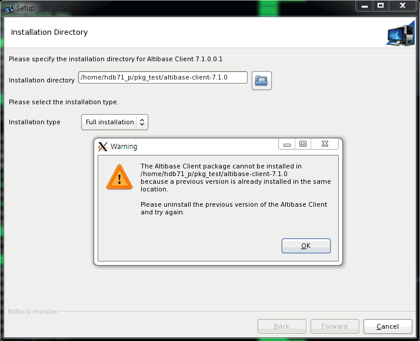
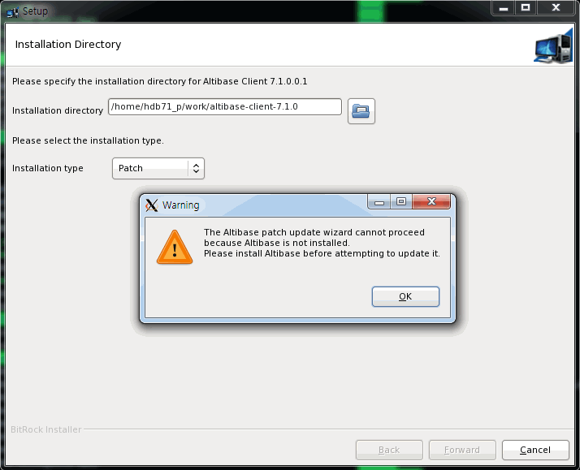
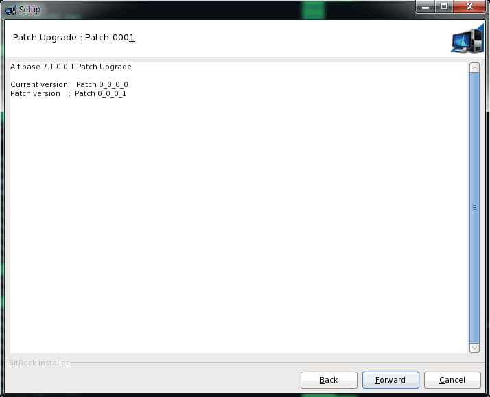

# 4. Patching Products With the Altibase Package Installer

This chapter consists of the following sections:

-   [About Patches](#about-patches)

-   [Patching Altibase Server Products](#patching-altibase-server-products)

-   [Patching Altibase Client Products](#patching-altibase-client-products)

### About Patches

A patch is a small collection of files that is used to overwrite an existing installation. Patches are associated with particular versions of Altibase Products. Patches are bug fixes that are made available to users in response to specific bugs. They require a particular base release or patch set to be installed before being applied.

#### Installation Types for Altibase Products

*Table 4-1 Full Package vs. Patch Package*

| Installation Steps                           | Full Package | Patch Package |
| -------------------------------------------- | :----------: | :-----------: |
| Checking the Environment Before Installation | ○            | ○             |
| Starting the Altibase Package Installer      | ○            | ○             |
| Checking System Parameters                   | ○            |               |
| Entering the Installation Directory          | ○            | ○             |
| Checking the Patch Version                   |              | ○             |
| Setting Altibase Properties                  | ○            |               |
| Confirming the Altibase Properties           | ○            |               |
| Installing the Altibase Product              | ○            | ○             |
| Registering the Altibase License Key         | ○            |               |
| Previewing the Altibase Quick Settings Guide | ○            |               |
| Finishing Installation                       | ○            | ○             |

#### Installation Types for Altibase Client Product

*Table 4-2 Full Package vs. Patch Package*

| Installation Steps                           | Full Package | Patch Package |
| -------------------------------------------- | :----------: | :-----------: |
| Checking the Environment Before Installation | ○            | ○             |
| Starting the Altibase Package Installer      | ○            | ○             |
| Entering the Installation Directory          | ○            | ○             |
| Checking the Patch Version                   |              | ○             |
| Setting Altibase Properties                  | ○            |               |
| Installing the Altibase Client Product       | ○            | ○             |
| Finishing Installation                       | ○            | ○             |

### Patching Altibase Server Products

The following sections describe how to apply patches for Altibase Server Products.

#### Checking the Environment Before Installation

Please refer to [Check the Environment Before Installation](../Installation%20Guide/2.-Installing-Products-with-the-Altibase-Package-Installer.md#check-the-environment-before-installation).

#### Downloading the Altibase Package Installer

Altibase does not offer a separate installation file for patches. When users start the Package Installer, users can select the installation type - either the "Full Installation" or "Patch". 

Download the appropriate installer for your operating system from [Altibase's Customer Support site](http://support.altibase.com/en/).

#### Setting the Installation Mode

To install the Package Installer in GUI mode, please refer to [Set the Installation Mode](../Installation%20Guide/2.-Installing-Products-with-the-Altibase-Package-Installer.md#set-the-installation-mode).

#### Starting the Altibase Package Installer

To run the Altibase Package Installer, users must download the Package Installer and then change the permissions of the file, using chmod.

```bash
$ chmod +x altibase-server-7.1.0.0.1-LINUX-X86-64bit-release.run
```

Run the Altibase Package Installer.

```bash
$./altibase-server-7.1.0.0.1-LINUX-X86-64bit-release.run
```

<div class="image_description" markdown>
{width=720px align=left}
If the installation mode is set to GUI mode, the Start panel on the left is displayed.
</div>

#### Entering the Installation Directory and Selecting the Installation Type

In the Installation Directory panel, enter the Altibase home directory containing the product to be patched and select "Patch Installation" for the installation type.

Patches require the base release to be installed before being applied. If an Altibase product has not been installed to the directory specified by the user, a warning message is displayed in a dialog box.

However, if users select "Full Installation" for the Installation Type, the installation steps are identical to those for Altibase Server Products. Please refer to [Installing Altibase Product](../Installation%20Guide/2.-Installing-Products-with-the-Altibase-Package-Installer.md#install-the-altibase-product).

=== "Selecting Full Installation"
    

=== "Selection Patch"
    

#### Checking the Patch Version

<div class="image_description" markdown>
{width=720px align=left}
This panel shows the patch version applied to the Altibase product that is currently installed in the selected directory and the patch version to be applied.
</div>

#### Installing the Altibase Product


#### Finishing Installation 


### Patching Altibase Client Products

This section describes how to apply Altibase client patches

#### Checking the Environment Before Installation

Please refer to [Checking the Environment Before Installation](#checking-the-environment-before-installation).

#### Downloading the Altibase Package Installer

Altibase does not offer a separate installation file for patches. When users start the Package Installer, users can select the installation type - either the "Full Installation" or "Patch". Download the appropriate installer for your operating system from [Altibase's Customer Support site](http://support.altibase.com/en/)

#### Setting the Installation Mode

To install the Package Installer in GUI mode, please refer to [Set the Installation Mode](../Installation%20Guide/2.-Installing-Products-with-the-Altibase-Package-Installer.md#set-the-installation-mode).

#### Starting the Altibase Package Installer

To run the Altibase Package Installer, Unix users must download the Package Installer, and then change the permissions of the file, using chmod.

```bash
$ chmod +x altibase-client-7.1.0.0.1-LINUX-X86-64bit-release.run
```

Run the Altibase Package Installer

```bash
$./altibase-client-7.1.0.0.1-LINUX-X86-64bit-release.run
```

<div class="image_description" markdown>
{width=720px align=left}
If the installation mode is set to GUI mode, the Start panel on the left is displayed.
</div>

#### Entering the Installation Directory and Selecting the Installation Type

In the Installation Directory panel, enter the Altibase home directory where the patch version will be applied, and select the installation type as "Patch".

The base release must be installed before applying the patch. If the Altibase product is not installed in the directory users specified, a dialog box appears with a warning message. However, if users select "Full Installation" for the installation type, the installation steps are identical to those for Altibase Client Products. Please refer to [Installing Altibase Client Products](../Installation%20Guide/2.-Installing-Products-with-the-Altibase-Package-Installer.md#installing-altibase-client-products).

=== "Selecting Full Installation"
    

=== "Selecting Patch"
    

#### Checking the Patch Version

<div class="image_description" markdown>
{width=720px align=left}
This panel shows the patch version applied to the Altibase product that is currently installed in the selected directory and the patch version to be applied. 
</div>

#### Installing the Altibase Product


#### Finishing Installation


