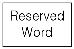

## Preface
### About This Manual

This manual explains the concepts, components, and basic use of Altibase.

#### Audience

This manual has been prepared for the following Altibase users:

-   Database managers
-   Performance managers
-   Database users
-   Application developers
-   Technical support engineers

It is recommended for those reading this manual possess the following background knowledge:

-   Basic knowledge in the use of computers, operating systems, and operating system utilities
-   Experience in using relational databases and understanding of database concepts
-   Computer programming experience
-   Experience in database server management, operating system management, or network administration

#### Organization

This manual has been organized as follows:

Chapter 1: Introduction
: This chapter provides an overview of Altibase replication

Chapter 2: Managing Replication  
: This chapter explains how to manage Altibase replication.

Chapter 3: Deploying Replication  
: This chapter explains how to deploy Altibase replication.

Chapter 4: Fail-Over  
: This chapter explains the Fail-Over feature provided by Altibase and how to use it.

Appendix A. FAQ
: This appendix includes FAQs related to the replication.

#### Documentation Conventions

This section describes the conventions used in this manual. Understanding these conventions will make it easier to find information in this manual and other manuals in the series.

There are two sets of conventions:

-   Syntax diagrams
-   Sample code conventions

##### Syntax diagrams

This manual describes command syntax using diagrams composed of the following elements:

| Elements                                         | Meaning                                                      |
| ------------------------------------------------ | ------------------------------------------------------------ |
|  | Indicates the start of a command. If a syntactic element starts with an arrow, it is not a complete command. |
|               | Indicates that the command continues to the next line. if a syntactic element ends with this symbol, it is not a complete command. |
|               | Indicates that the command continues from the previous line. If a syntactic element starts with this symbol, it is not a complete command. |
|               | Indicates the end of a statement.                            |
|               | Indicates a mandatory element.                               |
|               | Indicates an optional element.                               |
|               | Indicates a mandatory element comprised of options. One, and only one, option must be specified. |
|               | Indicates an optional element comprised of options           |
|               | Indicates an optional element in which multiple elements may be specified. A comma must precede all but the first element. |

##### Sample Code Conventions

The code examples explain SQL, stored procedures, iSQL, and other command line syntax.

The following describes the conventions used in the code examples:

| Rules            | Meaning                                                      | Example                                                      |
| ---------------- | ------------------------------------------------------------ | ------------------------------------------------------------ |
| [ ]              | Indicates an optional item                                   | VARCHAR [(*size*)] [[FIXED \|] VARIABLE]                     |
| { }              | Indicates a mandatory field for which one or more items must be selected. | { ENABLE \| DISABLE \| COMPILE }                             |
| \|               | A delimiter between optional or mandatory arguments.         | { ENABLE \| DISABLE \| COMPILE } [ ENABLE \| DISABLE \| COMPILE ] |
| . . .            | Indicates that the previous argument is repeated, or that sample code has been omitted. | SQL\> SELECT ename FROM employee;  ENAME   -----------------------  SWNO   HJNO   HSCHOI   .  .  .  20 rows selected. |
| Other Symbols    | Symbols other than those shown above are part of the actual code. | EXEC :p1 := 1; acc NUMBER(11,2)                              |
| Italics          | Statement elements in italics indicate variables and special values specified by the user. | SELECT \* FROM *table_name*;  CONNECT *userID*/*password*; |
| Lower case words | Indicate program elements set by the user, such as table names, column names, file names, etc. | SELECT ename FROM employee;                                  |
| Upper case words | Keywords and all elements provided by the system appear in upper case. | DESC SYSTEM_.SYS_INDICES_;                                   |

#### Related Documents

Please refer to the following documents for more detailed information:

-   Installation Guide

-   Administrator’s Manual

-   Getting Started Guide

-   SQL Reference

-   iSQL User’s Manual

-   Error Message Reference

#### Altibase Welcomes Your Comments and Feedback

Please let us know what you like or dislike about our manuals. To help us with better future versions of our manuals, please tell us if there are any corrections or classifications that you would find useful.

Include the following information: 

-   The name and version of the manual that you are using
-   Any comments about the manual
-   Your name, address, and phone number

If you need immediate assistance regarding any errors, omissions, and other technical issues, please contact [Altibase's Support Portal](http://support.altibase.com/en/).

Thank you. We always welcome your feedback and suggestions.

